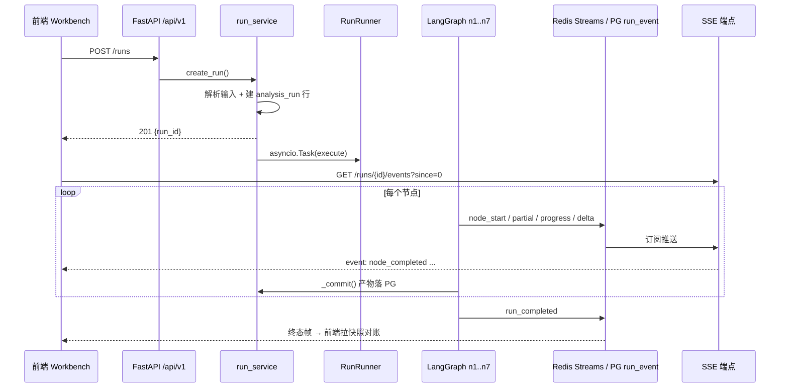

# 观心 · 运行流程与技术栈

> 这份文档回答三个问题：**一次分析从点击到出结果经过了哪些环节**、**每个环节用的是什么技术**、**这些技术在哪个文件里**。
> 路径一律相对于仓库根 `D:\agentcode\workspace_pycharm_llm\ChengQiYi`。

---

## 0. 一句话说明它是什么

**一个工作流（workflow）项目，不是 agent 项目。** 控制流是人写死的：7 个节点线性串联 `n1 → n2 → … → n7 → END`，没有条件边、没有工具调用、没有「模型决定下一步做什么」。模型只在固定几个点位被当成函数调用（n3 逐簇命名、n4 抽取、n6 推理、n7 文学化、知识库打标），**调用几次由节点里的循环决定**，不由模型决定；每次调用之后都由 Python 做校验与裁剪。

拓扑定义在 `backend/app/graph/builder.py:64-80`，该文件开头写明了「不做条件分支是刻意的」。

---

## 1. 技术栈总览

| 层 | 技术 | 版本 | 代码位置 |
|---|---|---|---|
| Web 框架 | FastAPI + uvicorn | ≥0.115 / ≥0.32 | `backend/app/main.py`、`backend/app/server.py` |
| 配置 | pydantic v2 + pydantic-settings | ≥2.9 | `backend/app/config.py` |
| 编排 | **LangGraph**（StateGraph + checkpointer） | ≥0.2.60 | `backend/app/graph/builder.py` |
| 检查点 | langgraph-checkpoint-postgres（psycopg3） | ≥2.0 | `backend/app/graph/builder.py:88-160` |
| 关系库 | PostgreSQL 16 + SQLAlchemy 2.0 async + asyncpg | ≥2.0.36 | `backend/app/db/session.py`、`backend/app/models/` |
| 向量库 | Qdrant v1.19.1 + qdrant-client | ≥1.19 | `backend/app/clients/qdrant_client.py`、`backend/app/kb/qdrant_index.py` |
| 图库 | Neo4j 5 community + neo4j driver | ≥5.27 | `backend/app/clients/neo4j_client.py`、`backend/app/kb/neo4j_index.py` |
| 缓存 / 事件总线 | Redis 7 + redis-py（**Streams**） | ≥5.2 | `backend/app/clients/redis_client.py`、`backend/app/graph/bus.py` |
| 模型接入 | openai SDK（OpenAI 兼容端点） | ≥1.57 | `backend/app/providers/openai_compat.py`、`backend/app/providers/factory.py` |
| 对话模型 | DeepSeek `deepseek-chat`（默认） | — | `backend/app/config.py:56-62` |
| 向量模型 | SiliconFlow `BAAI/bge-m3`（1024 维） | — | `backend/app/config.py:65-70` |
| 抖音数据源 | MCP（`mcp` SDK，stdio/http） | ≥1.2 | `backend/app/douyin/mcp_provider.py`、`backend/app/douyin/factory.py` |
| 流式传输 | SSE（手写帧，非 EventSource） | — | `backend/app/api/v1/events.py`、`frontend/src/api/sse.ts` |
| 聚类 | scikit-learn HDBSCAN / KMeans + numpy | ≥1.5 / ≥2.0 | `backend/app/graph/nodes/n3_cluster.py` |
| 前端框架 | React 19 + TypeScript 5.7 + Vite 6 | — | `frontend/src/`、`frontend/vite.config.ts` |
| 前端样式 | Tailwind CSS 4（vite 插件） | ≥4.0 | `frontend/src/index.css`、`frontend/src/lib/theme.ts` |
| 前端状态 | Zustand 5（+ react-query Provider 已接线但未用） | ≥5.0 | `frontend/src/store/runStore.ts` |
| 日志 | structlog（JSON 可选） | ≥24.4 | `backend/app/logging_conf.py` |
| CLI | Typer | ≥0.15 | `backend/app/cli.py` |
| 测试 | pytest（后端）/ vitest + tsc（前端）/ Playwright | — | `backend/tests/`、`frontend/src/test/` |
| 基础设施 | Docker Compose（PG / Qdrant / Redis / Neo4j） | — | `docker-compose.yml` |

**依赖清单**：后端 `backend/requirements.txt`，前端 `frontend/package.json`。
**刻意不引入**：sentence-transformers / torch（embedding 走 API）、`hdbscan` 包（Windows 需 C 工具链，sklearn 已内置）、外部任务队列（V1 单进程）。

---

## 2. 启动流程

```
docker compose up -d          # PG:55432  Qdrant:56333  Redis:56379  Neo4j:7687/7474
cd backend && nohup .venv/Scripts/python.exe -m app.server >> server.log 2>&1 &
cd frontend && npm run dev    # http://localhost:5173，/api 代理到 127.0.0.1:8000
```

| 步骤 | 说明 | 位置 |
|---|---|---|
| 1. 起基础设施 | 四个容器，宿主机端口刻意避开默认值 | `docker-compose.yml` |
| 2. 起后端 | `python -m app.server` 而非直接 `uvicorn`：Windows 上必须把事件循环换成 `SelectorEventLoop`，否则 psycopg3 异步连接失败、检查点**静默降级为内存** | `backend/app/server.py` |
| 3. lifespan 初始化 | 建连接池 + **启动对账**：清理上次进程留下的僵尸运行 / 导入作业 | `backend/app/main.py:27-88` |
| 4. 起前端 | Vite dev server，`/api` 代理到 `127.0.0.1:8000`（用字面量 IP 绕开 IPv6 解析） | `frontend/vite.config.ts` |

> ⚠️ `API_RELOAD` 默认 `False` 且 `.env` 里没有该项 —— **改完后端代码必须手动 kill + 重启**，否则跑的是旧代码。验证方法：`curl -s http://127.0.0.1:8000/openapi.json | grep -c "<新文案>"`。

---

## 3. 主流程：一次分析运行

### 3.1 全景



### 3.2 逐段说明

**① 提交与建运行（同步，几十毫秒）**

- 前端 `Workbench.tsx` → `api.createRun()`（`frontend/src/api/endpoints.ts`）→ `POST /api/v1/runs`
- `backend/app/api/v1/runs.py:29` → `backend/app/services/run_service.py:69`
- **输入解析发生在这里，不是节点里**：抖音链接走 `backend/app/douyin/link.py`（含 SSRF 守卫，全后端唯一对用户输入发外部请求的地方）；粘贴文本走 `backend/app/services/text_source.py`。解析失败当场 400，不建注定失败的运行记录。
- 写 `analysis_run` 行（`status=queued`）→ `asyncio.create_task` 拉起后台执行（`run_service._spawn`）。**没有外部队列**，任务在进程内。

**② 图执行（后台异步，几十秒到几分钟）**

- 入口 `backend/app/graph/runner.py:65 RunRunner.execute`
- 取检查点：`AsyncPostgresSaver`（`thread_id = run_id`），DB 不可达时降级 `MemorySaver` 并发一条 warning（`backend/app/graph/builder.py:99-143`）
- `graph.astream(state, stream_mode=["updates", "custom"])` 顺序跑完 7 个节点

| 节点 | 做什么 | 用到的技术 | 代码位置 |
|---|---|---|---|
| n1 视频引入 | 取视频元数据 + 口播文案（可缺失） | Douyin provider（MCP / mock） | `backend/app/graph/nodes/n1_video.py`、`backend/app/douyin/` |
| n2 评论抓取 | 分页抓评论并清洗，**每页发一个 partial** | 数据源 provider + 文本清洗 | `backend/app/graph/nodes/n2_comments.py`、`backend/app/services/comment_service.py` |
| n3 评论聚类 | 评论向量化（Redis 缓存）→ 语义去重 → 聚类 → 质量闸门 → 逐簇 LLM 命名（失败用本地关键词兜底） | embedding API + **HDBSCAN**（兜底 KMeans，cosine）+ numpy + LLM | `backend/app/graph/nodes/n3_cluster.py`、`backend/app/providers/cache.py`、`backend/app/prompts/cluster_label.py`、`backend/app/kb/lexical_tags.py` |
| n4 心理语义抽取 | 每簇的情绪 / 话题 / 需求 | 一次 LLM 调用 | `backend/app/graph/nodes/n4_psych.py`、`backend/app/prompts/extract_psych.py` |
| n5 多路检索 | 向量路（主题像什么）+ 图谱路（情绪借什么意象说），RRF 融合、配额分配 | Qdrant + Neo4j + 自定义融合 | `backend/app/graph/nodes/n5_retrieval.py`、`backend/app/graph/retrieval.py`、`backend/app/kb/qdrant_index.py`、`backend/app/kb/neo4j_index.py` |
| n6 推理综合 | 产出推理链 + 机制说明，**Python 丢掉越界引用** | LLM + 确定性校验 | `backend/app/graph/nodes/n6_reasoning.py`、`backend/app/prompts/reasoning.py`、`backend/app/graph/validators.py` |
| n7 文学化生成 | 四段文学化表述，**逐字流式**；覆盖率不达标重生成一次 | LLM + 标记清洗 + 覆盖率校验 | `backend/app/graph/nodes/n7_literary.py`、`backend/app/prompts/literary.py` |

**③ 进度与事件（贯穿全程）**

- 节点内部通过 `backend/app/graph/emitting.py` 发自定义事件：`node_start` / `milestone` / `progress` / `partial` / `delta` / `warning`
- 进度分带唯一真源是 `backend/app/graph/registry.py`（`n1 2→15，n2 15→35，n3 35→50，n4 50→63，n5 63→78，n6 78→90，n7 90→100`），由 `backend/app/graph/progress.py` 跟踪、`GET /meta/pipeline` 下发给前端——**前端不硬编码任何一句中文文案**
- 每个事件双写：Redis Streams（`guanxin:run:<id>:events`，MAXLEN 2000）+ PG `run_event` 表（`runner.py:255 _record`）

**④ 产物落库**

- 每个节点结束时 `runner._on_updates` → `persist.apply_patch`（`backend/app/graph/persist.py`）写 PG
- 落库失败**不中断分析**——产物已通过事件发给前端了，库写不进去是「历史查不到」，不是「这次没结果」
- 表结构：`backend/app/models/run.py`（analysis_run / video / comment / cluster / psych_profile）、`backend/app/models/insight.py`（evidence / reasoning_step / insight_section）

**⑤ 推送到浏览器**

- `GET /api/v1/runs/{id}/events?since=<seq>`（`backend/app/api/v1/events.py`）
- 语义是「把 seq 之后的一切按序补齐，然后继续跟着发新的」：先回放（Redis Streams → 失败退回 PG `run_event`），再订阅增量
- 心跳用 SSE 注释帧 `: ping`（不占 seq、不进库）；终态运行回放完必须补一条终态帧，否则前端分不清「跑完了」和「断了」
- 前端不用 `EventSource`（它自带的重连不带 `since`）：`frontend/src/api/sse.ts` 手写帧解析 + 40s 静默看门狗 → `frontend/src/hooks/useRunStream.ts` → `frontend/src/store/applyEvent.ts`（纯函数，可单测）→ `frontend/src/store/runStore.ts`（Zustand）
- 三栏渲染：左 `components/source/`，中 `components/middle/`（进度流 / 聚簇 / 证据 / 侧写 / 推理链），右 `components/right/`（四段洞察 + `CitationChip` 引用角标）

**⑥ 收尾与中断**

- 正常结束：`run_completed` → `_finish()` 写 status / finished_at / duration_ms
- 用户中止：`POST /runs/{id}/cancel` 只**置标志位**，runner 在节点边界收尾并发 `run_cancelled`（不是 kill 任务）
- 进程被杀：下次启动时 `run_service.reconcile_orphans()` 把僵尸运行标 failed（error.code=`interrupted`）（`backend/app/main.py:67-70`）

---

## 4. 旁路流程：知识库导入

与主流程完全解耦，只有 n5 检索处汇合。

```
选文件 → POST /api/v1/kb/imports (multipart)
       → 按 zip 头嗅探：epub 解包成正文 / 纯文本解码（UTF-8→GBK）
       → split_document 切分 → 三道闸门（确认 800 段 / 硬上限 12000 段 / 体积 5MB·20MB）
       → 落盘抽取后的正文 + 建 kb_import_job 行
       → 后台任务：AI 打标（每 8 段一批）→ 嵌入（bge-m3）→ 三写（Qdrant 点 / Neo4j 图 / kb_document 行）
       → 前端轮询 GET /kb/imports/{id} 显示进度
```

| 环节 | 技术 | 代码位置 |
|---|---|---|
| 上传接口 | FastAPI `UploadFile` | `backend/app/api/v1/kb.py` |
| epub 解析 | 标准库 `zipfile` + `html.parser`（无第三方依赖） | `backend/app/kb/epub.py` |
| 编解码 | UTF-8 → GB18030 兜底 | `backend/app/kb/chunker.py` |
| 切分 | 段落优先，长段按句装箱 | `backend/app/kb/chunker.py` |
| AI 打标 | LLM + 校验 + 降级 | `backend/app/kb/tagging.py`、`backend/app/prompts/tag_chunks.py` |
| 嵌入 | bge-m3，按 chunk_id 哈希差分只算新内容 | `backend/app/kb/embedder.py` |
| 三写编排 | Qdrant + Neo4j + PG 的一致性处理 | `backend/app/kb/ingest.py`、`backend/app/services/kb_import_service.py` |
| CLI 入口 | `ingest-kb` / `import-kb` / `kb-search` | `backend/app/cli.py` |

---

## 5. 数据落点

| 存储 | 内容 | 位置 |
|---|---|---|
| PostgreSQL | 运行、视频、评论、簇、侧写、证据、推理步、洞察段、事件、案例、知识库登记、导入作业 | 11 张表，`backend/app/models/` |
| Qdrant | 知识库全部 chunk 正文 + 向量（collection `guanxin_kb_v1`，cosine，1024 维） | `backend/app/clients/qdrant_client.py` |
| Neo4j | 由情绪反查意象、再由意象找作品；节点 `Work/Chunk/Imagery/Emotion/Character/Concept`，**只存 snippet** | `backend/app/clients/neo4j_client.py`、`backend/app/kb/neo4j_index.py` |
| Redis | 事件流（Streams）、embedding/LLM 结果缓存、运行取消标志 | `backend/app/graph/bus.py`、`backend/app/providers/cache.py` |
| 本地磁盘 | 导入作业落盘的正文（`IMPORT_DIR`） | `backend/app/services/kb_import_service.py` |

**Qdrant 是知识库正文的唯一归宿**，Neo4j 只存 ≤60 字的片段——这样两个存储不会漂移。

---

## 6. 容易踩的几个点（都实测过）

| 现象 | 原因 | 位置 |
|---|---|---|
| 改了后端代码没生效 | `API_RELOAD=False`，必须手动重启 | `backend/app/config.py:40` |
| 刷新页面后能续上进度 | Redis **Streams** 而非 pub/sub；Streams 被裁剪时回退 PG `run_event` | `backend/app/graph/bus.py` 模块 docstring |
| 「逐字输出」退化成一次性出现 | 代理/nginx 缓冲了 SSE，必须关缓冲并去掉 content-encoding | `frontend/vite.config.ts`、`backend/app/api/v1/events.py:50-55` |
| 页面卡在「分析中」永不结束 | vite dev 代理不转发上游断开；前端 40s 静默看门狗兜底 | `frontend/src/api/sse.ts` |
| 检查点静默降级、刷新不能恢复 | Windows ProactorEventLoop 与 psycopg3 不兼容 | `backend/app/server.py` |
| 演示模式下进度跳变 | mock 节点瞬时完成，靠 `MOCK_MIN_STEP_DELAY_MS` 做节奏控制 | `backend/app/graph/runner.py:274-281` |

---

## 7. 常用命令

| 目的 | 命令 |
|---|---|
| 起基础设施 | `docker compose up -d` |
| 起后端 | `cd backend && nohup .venv/Scripts/python.exe -m app.server >> server.log 2>&1 &` |
| 起前端 | `cd frontend && npm run dev` |
| 后端测试 | `cd backend && PYTHONIOENCODING=utf-8 .venv/Scripts/python.exe -m pytest` |
| 前端检查 | `cd frontend && npx tsc --noEmit && npx vitest run` |
| 建表 / 灌语料 | `python -m app.cli init-db` / `ingest-kb` / `import-kb` |
| 检索自测 | `python -m app.cli kb-search "焦虑"` |
| 依赖探测 | `curl http://127.0.0.1:8000/api/v1/health/deps` |

---

## 8. V1 边界（明确未做）

- 导出报告、保存到案例库：界面上有按钮但**置灰**（`frontend/src/components/layout/BottomBar.tsx:36-43`）
- 不解析 mobi / azw3；不导入 epub 里的图片
- 不支持多 worker（事件总线与运行任务都在进程内）
- `echarts` 已在 `package.json` 中声明但**全仓未使用**；`@tanstack/react-query` 只在 `main.tsx` 接了 Provider，业务代码未用 `useQuery`
